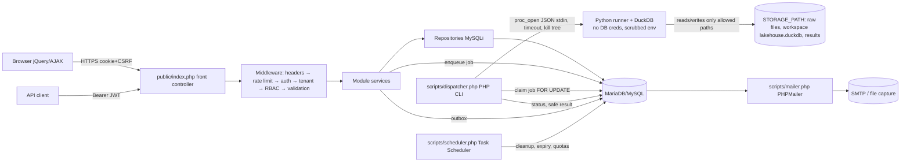
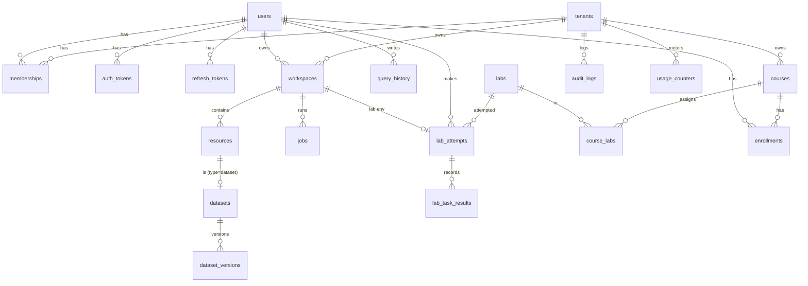

# EduCloud Lab — Implementation Master Plan

> Status: **APPROVED 2026-10-06.** Implementation in progress, milestone by milestone. See the per-task status in the commit history.
> Legend: **[V]** verified fact (from discovery on 2026-10-06), **[A]** assumption, **[R]** recommendation, **[U]** unresolved decision.

---

## 0. Context

EduCloud Lab is a new, independent educational platform. Students, instructors and institutions use it to practise cloud-resource management and modern data-platform workflows: workspaces, storage, lakehouse layers (raw→bronze→silver→gold), SQL analytics, pipelines, notebooks and dashboards. Labs are graded automatically, and no paid Azure or Fabric subscription is needed. The master specification (prompt §1–§56) requires PHP + MySQL(i) + jQuery on XAMPP/Windows, a strict separation between control plane and execution plane, multi-tenant RBAC, and a declarative Lab Engine.

The user decided to **keep the installed PHP 8.1.6** instead of upgrading to 8.2+ (see ADR-001).

---

## 1. Executive Summary

- **Control plane:** PHP 8.1 (forward-compatible with 8.2–8.4), MariaDB/MySQL through MySQLi prepared statements, and server-rendered pages with jQuery/AJAX against a versioned REST API (`/api/v1`).
- **Execution plane:** a PHP CLI **dispatcher** claims jobs from a MySQL queue. For each job it launches a short-lived, **credential-less Python + DuckDB runner** under hard time and output limits. Student SQL never runs in Apache and never touches MySQL.
- **Lakehouse:** one DuckDB database file per workspace, with schemas `bronze`, `silver` and `gold`. Raw uploads are stored as files.
- **Arbitrary Python (notebooks)** is gated behind Docker-based isolation (M8). Until then, notebooks run in a safe demonstration mode only.
- **MVP:** the 14-step end-to-end flow (§51 of the spec) plus 4 complete labs (LAB-001, 003, 004, 005).

---

## 2. Discovery & Repository Analysis  (spec §4, plan §13)

| Item | Finding |
|---|---|
| Project dir | **[V]** `C:\xampp\htdocs\EduCloud Lab` is **empty**. No Git, no `.claude/`, no code. Nothing to preserve. Note: the path contains a space. |
| PHP | **[V]** 8.1.6 ZTS x64, built May 2022, Xdebug 3.3.2 loaded. **PHP 8.1 security support ended 2025-12-31 (EOL).** |
| PHP extensions | **[V]** mysqli, mysqlnd, openssl, mbstring, intl, fileinfo, curl, zip, gd, json, session, pdo_sqlite. **[V] sodium is NOT loaded.** |
| php.ini | **[V]** upload_max_filesize=40M, post_max_size=40M, memory_limit=512M, max_execution_time=120, SMTP=smtp.gmail.com via XAMPP sendmail |
| DB | **[V]** MariaDB 10.4.24 (XAMPP). Not MySQL. 10.4 is EOL upstream. **[V]** It has no `SKIP LOCKED` (needs 10.6+). |
| Apache | **[V]** 2.4.53, port 80, `mod_rewrite` loaded, DocumentRoot `C:/xampp/htdocs`. The vhosts file has only commented examples. **[V]** htdocs is shared with other projects (ecommerce, guskit, stackcodelab). |
| Services | **[V]** Apache and MySQL were not running at inspection time. |
| Tools | **[V]** Git 2.50.1, Composer 2.5.8, Python 3.11.3/3.11.9/3.13 (py launcher), Node 24.19 + npm 9.1, Java 21, Docker 28.2.2 CLI (**daemon not running**). **[V]** duckdb and pandas are not installed. |
| Mail | **[V]** XAMPP ships `mailtodisk`/`mailoutput`. Dev mail capture is possible without SMTP. |
| Claude Code | **[V]** User-level skills exist (ajustar-cv, browser-automation, …). There are no project skills or agents and no `~/.claude/agents`. **[V]** Connected MCPs: Claude Docs, Gmail, Calendar, Drive. None is needed for this project. |
| Security note | **[V]** `C:\xampp\passwords.txt` exists. XAMPP's default MariaDB `root` likely has no password **[A]**. The app will never use root (§16). |

**Technical debt and risks found:** EOL PHP/MariaDB, a shared htdocs (anything placed under the project root is reachable at `http://localhost/EduCloud%20Lab/...` unless denied), and a path with a space.

---

## 3. Product Vision, Problem, Personas  (§2–4)

- **Problem:** Cloud and data-platform skills need hands-on practice. Paid subscriptions and limited trial credits block students, and labs are rarely graded automatically or reproducibly.
- **Vision:** a self-hostable, low-cost and secure environment that teaches the *concepts* (resources, identity, storage, lakehouse, SQL, pipelines, analytics) through guided, auto-graded labs. It is **not** a clone of Azure or Fabric and claims no affiliation with Microsoft (disclaimer in the footer and README).

| Persona | Goal | Key needs |
|---|---|---|
| Student (María, data-eng bootcamp) | Practise end-to-end data workflows | Guided labs, instant feedback, no setup cost |
| Instructor (Prof. Ruiz) | Assign labs and track progress | Course enrollment, progress grid, failed-task view |
| Org admin (university IT) | Run it for a cohort | Tenant management, quotas, audit |
| Platform admin | Operate the install | Health, jobs, users, cleanup |
| Independent learner | Self-paced learning | Personal tenant, public catalog |

---

## 4. Requirements  (§5–6)

**Functional (MVP):**
- Register, verify email, log in and out, reset password.
- Personal tenant per user, plus organizations.
- Workspace and resource CRUD with lifecycle states.
- CSV upload → raw → bronze ingestion with schema discovery.
- Dataset explorer.
- SQL Lab (SELECT-only) with history.
- SQL transforms creating silver and gold tables.
- Lab Engine (start, hints, submit, server-side validation, score).
- Minimal courses (create, join code, assign labs, progress view).
- Audit log.
- Quotas and cleanup.
- Email via outbox.

**Non-functional:**
- Security gates per milestone (release-blocking).
- WCAG 2.1 AA target.
- Runs on Windows XAMPP with no internet at runtime (all assets vendored).
- p95 page/API latency target set after M5 measurement. No numbers are claimed until measured.
- UI in Spanish behind an i18n layer **[A]** (the default, since the user did not choose). Code, identifiers and technical docs in English.

---

## 5. Capability Mapping  (§19, §31)

| Reference concept | Educational objective | EduCloud equivalent | Tech | Priority | Complexity | Security note |
|---|---|---|---|---|---|---|
| Resource groups / lifecycle | Organise and own resources | Workspace + Resource registry, states `provisioning→active→deleting→deleted` | PHP/MySQL | MVP | M | Tenant-scoped repos |
| Identity / RBAC | Least privilege | Tenants, memberships, 5 roles × 8 permissions | PHP | MVP | M | Release-blocking isolation tests |
| Object storage | Containers, blobs, metadata | "Storage" resource holding raw files under generated keys | Local FS (S3-compatible later) | MVP (basic) / P2 (full LAB-002) | S | No user paths, outside web root |
| Lakehouse | Files vs tables, layers | Per-workspace DuckDB file with bronze/silver/gold schemas | DuckDB | MVP | M | Read-only conn, external access off |
| SQL analytics endpoint | Analytical SQL | SQL Lab | DuckDB | MVP | M | SELECT-only allowlist, timeouts |
| Data ingestion | Load and validate | Upload → ingest job | PHP + DuckDB | MVP | M | Content validation, limits |
| Pipelines | Orchestrated ETL | JSON pipeline (Input→Transform→Validate→Output) compiled to DuckDB SQL | PHP + worker | P2 (M7) | M | Allowlisted node types only |
| Warehouse | Star schema, SCD | Gold-layer star schema labs + DDL-by-template | DuckDB | P2 (LAB-007) | M | Same sandbox |
| Notebooks | Python exploration | Cell notebook run in Docker sandbox | Python, Docker | P3 (M8) | H | **Gated on isolation** |
| Spark | Distributed concepts | Local PySpark container | Spark | Future | H | Container only |
| Semantic model | Measures and dimensions | JSON semantic model over gold tables | PHP + DuckDB | P2 | M | Generated SQL only |
| Dashboards | Visual analytics | KPI, bar and line charts with filters | Chart.js | P2 (M9) | M | Query via semantic layer |
| Data quality | Rules and expectations | Validate node + lab checks (nulls, unique, range) | DuckDB | MVP (lab checks) / P2 (pipeline node) | S | — |
| Lineage | Provenance | `dataset_lineage` edges from transforms and pipelines | MySQL | P2 | S | — |
| Monitoring / logging | Observability | Job history, audit log, admin monitor | PHP | MVP (basic) | S | No secrets in logs |
| Secrets | Secret handling | Concept lab only. App secrets in `.env` | — | Future lab | S | — |
| Regions / networking / serverless / IaC | Cloud concepts | Simulated metadata (region field, IaC = JSON workspace template export/import) | PHP | P3 / Future | S | Template import validated |
| Containers / compute | Isolated compute | Docker execution workers | Docker | P3 | H | — |
| Governance | Access and classification | Dataset sensitivity tags + audit | PHP | Future | S | — |

---

## 6. MVP Scope vs. Deferred  (§8–9)

**MVP (Release 1.0):**
- M0–M6.
- The minimal course slice from M10 (M10a).
- The hardening gates from M11 (M11a).
- Labs **LAB-001, LAB-003, LAB-004, LAB-005**, all complete and tested.
- E2E flow (§51 of the spec) passing in Playwright.

**Deferred:**

| Release | Scope |
|---|---|
| 1.1 | Pipelines (M7) + LAB-006; JSON/Parquet ingestion; LAB-002 full object storage; JWT API clients if not in 1.0 |
| 1.2 | Warehouse + semantic model + dashboards (M9) + LAB-007/009; modules/lessons; instructor-authored labs via UI |
| 1.3 | Docker sandbox + notebooks (M8) + LAB-008; LAB-010 capstone end-to-end |
| Future | Spark, S3/MinIO backend, JupyterHub, custom roles, SSO, lineage graph UI |

---

## 7. Architecture Options & Recommendation  (§10–12, §16)

**Options considered:**
- **(A)** PHP executes queries in-process.
- **(B)** PHP spawns a runner synchronously per request.
- **(C)** A queue with a dispatcher plus isolated runner processes.
- **(D)** Microservices.

**Chosen: C.** Option A violates spec §16. B ties Apache workers to long jobs and leaves no central quota point. D is overkill.



**Technology decisions:**

| Area | Decision | License |
|---|---|---|
| Language | PHP 8.1 syntax only (no readonly classes, DNF types, typed class constants, `json_validate`). CI also runs 8.3. | — |
| DB access | MySQLi + prepared statements via a thin `Db` helper | — |
| Autoload | Composer PSR-4 `EduCloud\` → `app/` | — |
| JWT | `firebase/php-jwt` ^7 (6.x has CVE-2025-45769), HS256 + `kid` key ring (sodium absent, so no EdDSA) | BSD-3 |
| Mail | `phpmailer/phpmailer` ^6 | LGPL-2.1 (unmodified library use) |
| Env | `vlucas/phpdotenv` ^5 | BSD-3 |
| Lab schema | `opis/json-schema` ^2 | Apache-2.0 |
| Markdown (lab text) | `league/commonmark` ^2, `html_input: escape` | BSD-3 |
| Frontend | jQuery 3.7, Bootstrap 5.3, SweetAlert2 (non-`.all` build + CSS), Font Awesome Free 6, CodeMirror 5 (SQL mode), Chart.js 4. **All vendored locally** for CSP and offline use. | MIT; FA icons CC BY 4.0 / fonts OFL |
| Execution | Python 3.11 venv + `duckdb` (pinned) | MIT / PSF |
| Tests | PHPUnit 10.5 (the last line supporting PHP 8.1), PHPStan, PHP_CodeSniffer (PSR-12), pytest, Playwright | BSD-3 / MIT / Apache-2.0 |
| Dev mail | `MAIL_DRIVER=file` writes `.eml` to `storage/mail/`. Mailpit is optional. | — |
| Router / migrations | Small in-house (≈100 LOC each). Avoids extra dependencies. | — |

---

## 8. Repository Structure  (§8, §14)

```
EduCloud Lab/
├── public/                    # ONLY web root (vhost DocumentRoot)
│   ├── index.php              # front controller: pages + /api/v1
│   ├── .htaccess              # rewrite to index.php, security headers fallback
│   ├── robots.txt, sitemap.xml (generated route)
│   └── assets/{css,js/core,js/features,img,vendor}
├── app/
│   ├── bootstrap.php
│   ├── Core/        Config, Db, Router, Request, Response, ErrorHandler, Logger, Session,
│   │                Csrf, RateLimiter, Validator, View (escaping), I18n, Ulid, Clock, Jwt
│   ├── Http/Middleware/  SecurityHeaders, RateLimit, Authenticate, ResolveTenant, Authorize, Csrf
│   ├── Modules/{Auth,Users,Tenants,Workspaces,Resources,Storage,Datasets,Jobs,SqlLab,
│   │            Transforms,Labs,Courses,Email,Audit,Admin,PublicSite}/
│   │      routes.php, *Controller.php, *Service.php, *Repository.php, *Validator.php, views/
│   └── Views/layouts, partials
├── config/        app.php, database.php, security.php, quotas.php, permissions.php (read .env)
├── database/      migrations/NNNN_name.up.sql|.down.sql, seeds/, schema/ (generated dump + ERD)
├── worker/        runner.py, ops/{ingest,query,transform,validate}.py, sandbox.py,
│                  requirements.txt (pinned + hashes), tests/
├── labs/          schema/lab.schema.json, LAB-001/{lab.json,instructions.es.md,solution/,data/}
├── courses/       sample course definitions
├── datasets/      samples/ (synthetic retail CSV, CC0) + generator script
├── scripts/       migrate.php, seed.php, dispatcher.php, mailer.php, scheduler.php,
│                  labs-import.php, create-admin.php, check-env.php
├── tests/         Unit/, Integration/, Security/, E2E/ (Playwright), fixtures/
├── docs/          architecture/ security/ development/ deployment/ api/openapi.yaml
│                  database/ labs/ courses/ testing/ adr/
├── storage/       (default only; .env STORAGE_PATH recommended outside htdocs, e.g. C:\educloud-data)
├── .claude/       skills/, agents/
├── .htaccess      "Require all denied" (defense for shared htdocs)
├── .env.example, composer.json, phpunit.xml, phpstan.neon, phpcs.xml, package.json (dev: playwright)
├── README.md, CLAUDE.md, SECURITY.md, CONTRIBUTING.md, LICENSE, THIRD_PARTY_NOTICES.md
```

This adapts the spec's `api/v1/<module>` folders: API routes are declared per module and dispatched by one front controller. That gives one middleware pipeline and a route registry, and the registry makes the automated cross-tenant route matrix test possible.

**Hosting [R]:** add a vhost `educloud.test` → `.../EduCloud Lab/public` and a hosts-file entry. The user does this, because it touches the shared XAMPP config and needs admin rights. The root `.htaccess` denies everything else.

---

## 9. PHP Modular Architecture  (§7)

**Request pipeline:**

```
Router.match
→ SecurityHeaders
→ RateLimit(route policy)
→ Authenticate (session cookie OR Bearer JWT, never both)
→ ResolveTenant (from membership, never from client)
→ Authorize(permission, resource)
→ Validator(schema per route)
→ Service (business rules, transactions)
→ Repository (MySQLi prepared, tenant-scoped)
→ Response::json / View::render
```

**Conventions:**
- Controllers are thin. Services hold the rules. Repositories hold all SQL. Views escape output through `e()` (`htmlspecialchars` with `ENT_QUOTES|ENT_SUBSTITUTE`, UTF-8).
- Every tenant-owned repository method takes a `TenantContext` (tenant_id, user_id, role) as its first argument and filters by `tenant_id`.
- Cross-tenant access returns **404** (no enumeration).
- Dynamic ORDER BY uses allowlist maps only.
- Errors: domain exceptions map to codes such as `VALIDATION_ERROR`, `NOT_FOUND`, `FORBIDDEN`, `RATE_LIMITED`, `CONFLICT`, `QUOTA_EXCEEDED` and `INTERNAL_ERROR`. Every response carries a `request_id`. Internal details go only to the log.
- Public IDs are 26-character ULIDs (`public_id`) in URLs. Internal keys are BIGINT.

---

## 10. Database Architecture & ERD  (§9, §34)

**Engine and users:**
- InnoDB, utf8mb4 / `utf8mb4_unicode_ci`, FKs, CHECKs.
- SQL must stay portable across MariaDB 10.4 and MySQL 8.0. JSON columns are `JSON` with `json_valid` (a LONGTEXT alias on MariaDB).
- DB users:
  - `educloud_app`: SELECT/INSERT/UPDATE/DELETE on `educloud.*`
  - `educloud_migrator`: DDL
  - `educloud_test`: on `educloud_test`
- Root is never used at runtime.

**Migrations:**
- Numbered up/down SQL files, a `schema_migrations` table and a checksum guard.
- A backup is taken before migrating (`mysqldump`).

**Tenant integrity at DB level:** child tables carry `tenant_id` and **composite FKs** `(tenant_id, workspace_id) → workspaces(tenant_id, id)`, so a cross-tenant reference cannot be stored.

**Roles:** an ENUM on `memberships`, with the permission map in `config/permissions.php`. `roles` and `permissions` tables are deferred until custom roles exist (YAGNI, ADR-007).



**MVP tables (purpose, owner):**

| Table | Purpose | Owner / scope |
|---|---|---|
| `tenants` | Org or personal tenant (type, name, slug, status, quota profile) | platform |
| `users` | email (unique), password_hash, display_name, status (`pending/active/locked/disabled`), email_verified_at | global |
| `memberships` | (tenant, user, role ENUM), unique(tenant_id, user_id) | tenant |
| `auth_tokens` | Email-verify and reset tokens: SHA-256 hash, type, expires, used_at | user |
| `refresh_tokens` | JWT refresh: hash, family_id, rotated_from, revoked_at | user |
| `rate_limits` | key_hash, window_start, count (PK key_hash + window) | system |
| `workspaces` | tenant, owner, name, status, expires_at, course_id NULL, lab_attempt_id NULL | tenant |
| `resources` | tenant, workspace, type ENUM(storage, lakehouse, dataset, pipeline, notebook, dashboard), name, status, config JSON, unique(workspace_id, type, name) | tenant |
| `datasets` | resource_id, layer ENUM(raw, bronze, silver, gold), table_name (validated identifier), current_version_id | tenant |
| `dataset_versions` | storage_key, original_name (display only), bytes, sha256, rows, schema JSON, status | tenant |
| `jobs` | tenant, workspace, user, type, status, payload JSON, result_key, error_code, safe_message, attempts, timeout_s, timestamps, heartbeat_at | tenant |
| `query_history` | tenant, workspace, user, sql_text, duration_ms, rows, status | tenant |
| `labs` | code, version, title, difficulty, definition JSON, checksum, status | platform catalog |
| `lab_attempts` | tenant, user, lab, workspace, status, score, max_score, hints_used, started/submitted | tenant |
| `lab_task_results` | attempt, task_key, passed, points, feedback (safe), evidence JSON | tenant |
| `courses`, `course_labs`, `enrollments` | Course in an org tenant, join_code hash, assignments, enrollment status | tenant |
| `email_outbox` | to, template, payload JSON (no secrets), status, attempts | system |
| `audit_logs` | ts, request_id, tenant_id, actor_user_id, action, resource_type, resource_public_id, outcome, ip_hash (HMAC), meta JSON | tenant |
| `usage_counters` | tenant/user storage_bytes, job_seconds, period | tenant |

**Later:** pipelines, pipeline_runs, dataset_lineage (1.1); semantic_models, dashboards, modules, lessons (1.2); notebooks, notebook_runs (1.3).

**Indexes:**
- Every tenant table: `(tenant_id, …)` leading index.
- `jobs(status, created_at)`.
- `audit_logs(tenant_id, ts)`.
- `query_history(user_id, created_at)`.

---

## 11. REST API  (§12)

- **Base path** `/api/v1`. JSON envelope exactly as in spec §12, plus `meta.request_id` and pagination `meta.page / per_page / total`.
- **Status codes:** 201 on create, 202 on job enqueue, 204 on delete, 422 on validation, 401/403/404/409/429.

| Group | Endpoints (MVP) |
|---|---|
| auth | `POST /auth/register`, `/auth/login`, `/auth/logout`, `/auth/verify-email`, `/auth/password/forgot`, `/auth/password/reset`, `GET /auth/me`, `POST /auth/tokens` (JWT), `/auth/tokens/refresh`, `/auth/tokens/revoke` |
| tenants | `GET /tenants` (mine), `POST /tenants/{id}/switch` |
| workspaces | `GET/POST /workspaces`, `GET/PATCH/DELETE /workspaces/{id}` |
| resources | `GET/POST /workspaces/{id}/resources`, `GET/PATCH/DELETE /resources/{id}` |
| datasets | `POST /workspaces/{id}/datasets` (multipart upload), `GET /datasets/{id}`, `GET /datasets/{id}/preview`, `GET /datasets/{id}/schema`, `DELETE /datasets/{id}` |
| sql | `POST /workspaces/{id}/queries` → 202 job, `GET /queries/history`, `GET /workspaces/{id}/catalog` |
| transforms | `POST /workspaces/{id}/transforms` (SELECT body → target layer and table) → 202 |
| jobs | `GET /jobs/{id}`, `POST /jobs/{id}/cancel`, `GET /jobs/{id}/result` |
| labs | `GET /labs`, `GET /labs/{code}`, `POST /labs/{code}/start`, `GET /lab-attempts/{id}`, `POST /lab-attempts/{id}/hints/{task}`, `POST /lab-attempts/{id}/submit` → 202 validate job |
| courses | `GET/POST /courses`, `POST /courses/{id}/labs`, `POST /courses/join`, `GET /courses/{id}/progress` |
| admin | `GET /admin/jobs`, `GET /admin/audit`, `PATCH /admin/users/{id}` |

The OpenAPI 3.1 contract lives in `docs/api/openapi.yaml` and is updated per task (part of the DoD). A test asserts that every registered route is documented.

**Frontend conventions:**
- `js/core/api.js` wraps `$.ajax`: CSRF header, timeout, an error → SweetAlert2 mapper, and a double-submit guard (disable the button and track in-flight requests).
- Job polling helper with backoff.
- One JS file per feature.

---

## 12. Authentication & Authorization  (§11, §18)

**Browser:**
- Server-side PHP sessions. Cookie flags: `HttpOnly`, `SameSite=Lax`, and `Secure` when HTTPS.
- `session_regenerate_id` on login and privilege change.
- Idle timeout 30 min, absolute timeout 8 h.
- **CSRF synchronizer token** on every state-changing request (an `X-CSRF-Token` header for AJAX, a hidden field for forms).

**JWT (non-browser API clients):**
- Access token: HS256, 15 min, with claims `iss`, `aud`, `sub` (user public_id), `tid`, `iat`, `exp`, `jti` and a `kid` header. Algorithm pinned, issuer and audience verified.
- Refresh token: opaque, 30 days, stored as a hash, **rotated on every use with reuse detection** (the whole family is revoked).
- Keys live in `.env` as a key ring for rotation.
- Accepted only through the `Authorization: Bearer` header. Cookies are never read on the JWT path, so the JWT path has no CSRF exposure.

**Account rules:**
- `password_hash` (PASSWORD_DEFAULT) with rehash on login. Minimum 12 characters. No composition rules.
- Generic login error.
- Rate limits: 5 failures per 15 min per account+IP hash, plus a global IP throttle. Progressive lock.
- Verify and reset tokens: 32 random bytes, stored hashed, single use, 30–60 min TTL. Reset revokes all sessions and refresh tokens.
- Passwords are never emailed.

**Roles and permissions:**

| Permission \ Role | platform_admin | org_admin | instructor | student | read_only |
|---|---|---|---|---|---|
| create (own workspaces/resources) | ✓ | ✓ | ✓ | ✓ | – |
| read own | ✓ | ✓ | ✓ | ✓ | ✓ |
| read tenant-wide | ✓ | ✓ | course-scoped | – | – |
| update / delete own | ✓ | ✓ | ✓ | ✓ | – |
| execute (jobs) | ✓ | ✓ | ✓ | ✓ | – |
| assign (labs to course) | ✓ | ✓ | ✓ | – | – |
| review (attempts) | ✓ | ✓ | course-scoped | – | – |
| administer (members, quotas) | ✓ | ✓ | – | – | – |

**Tenancy:** registration creates a **personal tenant** (role student or owner). Joining a course creates a membership in the course's org tenant. The active tenant is stored in the session and checked against memberships on every request.

---

## 13. Multi-Tenancy  (§18)

- **Model:** shared tables with `tenant_id` (ADR-004).
- **Enforcement at three layers:**
  1. The `ResolveTenant` middleware derives the tenant from membership.
  2. Repositories require a `TenantContext`.
  3. Composite FKs at DB level.
- Storage paths are `{STORAGE_PATH}/t/{tenant_ulid}/w/{workspace_ulid}/...`, built only from DB values.
- **Release-blocking test (`tests/Security/TenantIsolationTest`):** two tenants with seeded resources. The test iterates over **every route in the registry** that contains `{id}`, uses tenant B's IDs with tenant A's identity across GET/PATCH/DELETE/execute, and asserts 404 with no side effects (row checksums unchanged). Jobs and storage are covered by a runner test that tries to reach another workspace's path.

---

## 14. Security Threat Model  (§10, §21)

| Threat | Mitigation | Verification |
|---|---|---|
| SQLi (app) | MySQLi prepared statements. Identifier allowlists. | Unit tests on repos + payload suite |
| SQLi / abuse (SQL Lab) | DuckDB only, never MySQL. Statement type must be SELECT. `enable_external_access=false`, `lock_configuration=true`, `autoload/autoinstall_known_extensions=false`. Read-only connection to the workspace DB only. Timeout + interrupt. Row and byte caps. | `tests/Security/SqlSandboxTest` (COPY, ATTACH, INSTALL/LOAD, PRAGMA, `read_csv('C:/…')`, `SET`, multi-statement, long cross joins) |
| XSS (stored, reflected, DOM) | `e()` everywhere. jQuery `.text()`, never `.html()` with data. CommonMark with escaped HTML. CSP `default-src 'self'; script-src 'self'; object-src 'none'; frame-ancestors 'none'`. | Payload tests + CSP header test + Playwright console check |
| CSRF | Synchronizer token + SameSite | Tests without token → 403 |
| SSRF | No server-side URL fetching in MVP. DuckDB external access disabled (blocks `httpfs`). | Sandbox test |
| Path traversal | Generated storage keys. `realpath` prefix check. Original names are display-only. | Traversal payload tests |
| IDOR / BOLA / privilege escalation | Tenant context + RBAC + 404 policy. Role changes only by org_admin, audited. | Route matrix test |
| Malicious uploads | Extension and size allowlist, `finfo`, UTF-8 and NUL check, row/column caps in ingestion, stored outside web root, never executed, CSV-injection escaping on export | Fixture tests (polyglot, zip bomb named .csv, huge lines) |
| Brute force / credential stuffing | Rate limits, lockout, generic errors | Tests |
| Resource exhaustion | Quotas, job timeouts, concurrency caps, DuckDB `max_memory` / `threads`, output caps | Load-ish tests in M11 |
| JWT attacks | Pinned alg, kid lookup, exp/iss/aud checks, short TTL, refresh rotation | Tampering, `alg:none`, expired, wrong-aud tests |
| Secret leakage | `.env` outside VCS. Root `.htaccess` deny. Runner env scrubbed (no DB creds). Log redaction. | Test: HTTP GET of `/.env` and `/storage/*` returns 403/404 |
| Arbitrary code exec | No Python execution until the M8 Docker gate. Lab validators are declarative only. | Design review + tests |
| Tenant isolation failure | See §13 | Release-blocking |

**Headers:** CSP, `X-Content-Type-Options: nosniff`, `Referrer-Policy: strict-origin-when-cross-origin`, `Permissions-Policy`, and HSTS when on HTTPS.

**Error responses** never include SQL, stack traces or paths. `display_errors=0` in the app config.

---

## 15. Storage, Lakehouse, SQL Lab, Transforms  (§20–22)

**Storage:**
- A `StorageDriver` interface with a `LocalFsDriver` implementation (MVP). An `S3Driver` (MinIO/S3) is planned for later.
- Keys are ULIDs. Files are written atomically: temp file, then rename. SHA-256 is recorded.

**Ingestion (CSV, MVP):**
1. PHP validates the upload and stores the raw file, creating `dataset(layer=raw)`.
2. PHP enqueues an `ingest` job.
3. The runner, a trusted code path with the input path supplied by the dispatcher (never by the user), runs `read_csv(..., sample_size=…)` to sniff the schema. It enforces the row and column caps and creates `bronze.<name>` in the workspace `lakehouse.duckdb`.
4. The schema, row count and status are written back.

**Medallion layers:**
- **raw:** the file, unchanged.
- **bronze:** a 1:1 typed table.
- **silver:** a student SELECT executed by the Transforms module as `CREATE OR REPLACE TABLE silver.<validated_identifier> AS <select>`. The student SELECT is checked to be a single SELECT. The target name must match `^[a-z][a-z0-9_]{0,62}$`.
- **gold:** same mechanism as silver.

Students never write DDL directly. Write jobs are serialised **per workspace** because DuckDB has a single writer. JSON and Parquet ingestion come in 1.1 (Parquet checked by its `PAR1` magic bytes).

**SQL Lab:**
- CodeMirror 5 editor, catalog tree (layers → tables → columns), results grid (first 1,000 rows), duration, safe error text (DuckDB message with paths stripped) and history.
- Exercise mode for LAB-003 lists progressive tasks: SELECT, WHERE, JOIN, GROUP BY / HAVING, CTEs, subqueries, window functions and dates.

**Runner contract:**
- Input: JSON on stdin `{op, workspace_db, inputs[], sql?, limits{timeout_s, max_rows, max_bytes, max_memory, threads}}`.
- Output: JSON on stdout `{ok, data|error_code, safe_message, stats}`.
- The dispatcher enforces wall-clock timeout, kills the process tree (`taskkill /T /F` on Windows) and caps stdout size.
- The child process gets a minimal environment (PATH and TEMP only).

**Known Windows limitation [V/R]:** XAMPP on Windows has no cgroups, seccomp or network namespaces. That is acceptable for the MVP **only because** the runner executes DuckDB SQL with external access disabled and never runs arbitrary Python. **Spike M5-T01** must confirm the exact DuckDB settings on the pinned version.

---

## 16. Pipelines, Notebooks, Warehouse, Dashboards  (§23–25)

**Pipelines (M7, 1.1):**
- A JSON definition: a linear chain of nodes (`csv_input | dataset_input | filter | select | join | aggregate | sql | quality_check | output`).
- PHP validates it against a JSON Schema. The runner compiles each node to parameterised DuckDB SQL from templates and runs the steps with per-step status.
- Retry policy: 0–2 attempts for transient errors only. Cancellation and cleanup of intermediate tables.
- Airflow, Dagster and Prefect were evaluated and rejected: too heavy for XAMPP and they need servers or databases. Recorded in ADR-009.

**Notebooks (M8, 1.3) — gated:**
- Docker Desktop must be running.
- Each run starts an ephemeral container `educloud-nb:pinned` (python-slim + duckdb + pandas + pyarrow) with these flags:
  - `--network none --read-only --tmpfs /tmp`
  - `--memory 512m --cpus 1 --pids-limit 128`
  - `--cap-drop ALL --security-opt no-new-privileges --user 10001`
  - workspace data mounted **read-only**, plus an output dir
  - timeout and kill, output cap
- Execution uses `nbclient` per run. No secrets in the container.
- **Gate:** the security suite (network egress, host FS, fork bomb, memory bomb, timeout) must pass. Until then: **demo mode** with pre-rendered read-only notebooks.
- JupyterHub with DockerSpawner is a Future institutional option.

**Warehouse and dashboards (M9, 1.2):**
- Star-schema labs on the gold layer.
- Semantic model JSON (measures, dimensions, joins) → generated SQL. Students never write the dashboard SQL.
- Chart.js widgets: KPI, table, bar, line, with filters and date ranges.

---

## 17. Lab Engine & Automatic Assessment  (§26–27)

**Definition format:** `labs/LAB-xxx/lab.json`, validated against `labs/schema/lab.schema.json` (JSON over YAML: no YAML extension is installed, and it avoids a dependency).

```json
{ "schema_version": 1, "code": "LAB-004", "version": "1.0.0", "title_key": "...", "difficulty": "beginner",
  "estimated_minutes": 45, "prerequisites": ["LAB-001"], "objectives": [...],
  "setup": [{"action": "copy_sample_dataset", "dataset": "retail/customers.csv", "as": "customers_raw"}],
  "tasks": [{ "key": "t3", "title": "...", "instructions_md": "instructions.es.md#t3", "points": 20,
      "hints": [{"text": "...", "penalty": 2}],
      "checks": [{"type": "dataset_exists", "layer": "silver", "table": "customers"},
                 {"type": "null_count", "table": "silver.customers", "column": "email", "op": "eq", "value": 0},
                 {"type": "row_count", "table": "silver.customers", "op": "between", "value": [900, 1000]}]}],
  "cleanup": {"workspace_ttl_days": 14}, "solution_ref": "solution/" }
```

**Trusted check types** (closed set; unknown types fail schema validation):
- Metadata checks (PHP): `workspace_exists`, `resource_exists`, `resource_config_equals`, `dataset_exists`.
- Data checks (runner): `table_has_columns`, `column_type`, `row_count`, `null_count`, `unique`, `value_range`, `query_result_matches` (author's reference SELECT vs. the student's saved query, both re-executed server-side, ordered or unordered, with numeric tolerance).
- `job_succeeded`, `pipeline_run_succeeded`.

**Lab flow:**
1. **Start** creates the attempt plus a dedicated workspace and runs the setup.
2. **Submit** enqueues a `validate` job that inspects the **actual state**. Client-claimed results are ignored.
3. Each task produces `lab_task_results`. Score = Σ points − hint penalties.
4. Resubmission is allowed. The best score is kept.

Solutions are visible only to instructors and admins. Labs are imported by CLI (`labs-import.php`) with a checksum and version. Instructor UI authoring arrives in 1.2. Every lab ships with **automated tests that apply the reference solution and assert score = max**, plus a negative test.

---

## 18. Course Management  (§28)

**MVP (M10a):**
- An instructor creates a course in an org tenant and assigns labs.
- Students join with a join code (stored hashed, rate-limited).
- A progress grid shows students × labs (status, score, failed tasks), with drill-down into attempt task results.

**Release 1.2:** modules and lessons (CommonMark content), publishing, due dates, notifications.

---

## 19. UX/UI Design System & Screens  (§15, §40)

- **Tokens:** CSS custom properties (`--ec-color-*`, `--ec-space-*`, `--ec-radius-*`, `--ec-font-*`) layered on Bootstrap 5.3.
- **Look:** an original teal and indigo palette, a system font stack, light theme first. Dark mode via `data-bs-theme` (cheap with Bootstrap 5.3, so included).
- **Shell:** collapsible left nav, top bar with tenant switcher, breadcrumbs.
- **Components:** cards, tables, forms, buttons, modals, tabs, status badges, skeleton loaders, empty states, error states, toast and SweetAlert2 patterns.
- **Accessibility:** visible focus, AA contrast checked, labels and `aria-live` for async results, keyboard-operable grids.

| Screen | Role | Primary task | MVP |
|---|---|---|---|
| Landing, Catalog, Course/Lab public pages | public | Discover | ✓ |
| Login / Register / Verify / Reset | public | Authenticate | ✓ |
| Student dashboard | student | Resume labs, see workspaces | ✓ |
| Workspace explorer | student+ | Create and manage workspaces | ✓ |
| Resource explorer | student+ | Resource CRUD and lifecycle | ✓ |
| Dataset explorer | student+ | Upload, schema, preview | ✓ |
| SQL editor | student+ | Query, history | ✓ |
| Lab interface | student | Instructions, tasks, hints, submit, feedback | ✓ |
| Instructor dashboard / course mgmt (minimal) | instructor | Assign, track | ✓ |
| Administration / Monitoring (basic) | admins | Users, jobs, audit | ✓ |
| Pipeline designer | student+ | — | 1.1 |
| Analytics dashboard | student+ | — | 1.2 |
| Notebook launch / status | student+ | — | 1.3 |

Each screen gets a spec in `docs/ux/screens/*.md` covering role, task, data, actions, loading, empty and error states, authorization and acceptance criteria. The `design` skill enforces the template.

---

## 20. SEO  (§14)

- The `PublicSite` module renders public pages server-side: semantic HTML, a unique `<title>` and meta description, canonical URL, Open Graph tags, `/sitemap.xml` built from published courses and labs, and `robots.txt`.
- Truthful JSON-LD `Course` markup.
- Clean URLs: `/courses/{slug}`, `/labs/{slug}`, `/learning/{slug}`.
- Every authenticated route sends `X-Robots-Tag: noindex, nofollow` and is excluded from the sitemap. Public lab pages show the description only, never solutions or task checks.

---

## 21. Claude Code Configuration, Skills, Subagents, MCP  (§35–39)

**`CLAUDE.md`** (≤ 150 lines): vision, mandatory stack (PHP 8.1 syntax), architecture rules, security rules, DB and API conventions, test commands, prohibited shortcuts, DoD. Detailed procedures live in skills.

**Skills** (`.claude/skills/<name>/SKILL.md`, current format with `name` and `description` frontmatter):

| Skill | Purpose |
|---|---|
| `design` | UX workflow, IA, tokens, component standards, screen-spec template, a11y checklist, empty/error/loading patterns, review criteria |
| `backend-feature` | Module scaffold pattern (routes → controller → service → repo), MySQLi helper usage, validation, authorization, OpenAPI update, test template, DoD checklist |
| `db-migration` | Migration naming, up/down, composite tenant FKs, index rules, backup and rollback steps |
| `data-execution` | Runner contract, DuckDB sandbox settings, job types, limits, adding an op safely |
| `lab-authoring` | lab.json schema, check types, solution tests, i18n text |
| `educloud-security-gate` | Per-milestone security checklist and test commands. Named to avoid clashing with the built-in `/security-review`, which it complements. |

**Subagents** (only 2, both read-only reviewers to avoid edit conflicts; the main session owns integration):
- **`security-reviewer`**
  - Tools: Read, Grep, Glob, Bash (tests only).
  - Skill: `educloud-security-gate`.
  - Input: the diff or milestone. Output: findings with severity.
  - Runs at every milestone gate.
- **`ux-reviewer`**
  - Tools: Read, Grep, Glob, plus the `browser-automation` skill.
  - Checks screens against the design skill and a11y criteria.

**MCP:** **none required for the MVP.** Native tools and CLIs (git, composer, php, the mysql client, Playwright) cover everything. A database MCP is rejected because it would expose credentials (use the CLI with the read-only `educloud_test` user). GitHub: the `gh` CLI, if the user sets up a remote. Nothing gets installed without authorization.

**Custom commands:** none. Skills replace the legacy `.claude/commands`.

---

## 22. Testing Strategy  (§41)

| Layer | Tool | Scope |
|---|---|---|
| Static | `php -l`, PHPStan (level 6 → 8), PHPCS PSR-12, ruff (Python) | All code |
| Unit | PHPUnit 10.5 | Validator, permissions map, services (fakes), JWT, ULID, lab-definition validation, scoring, SQL identifier guards |
| Integration | PHPUnit + `educloud_test` DB (transaction rollback per test) + in-process kernel dispatch | Repos, API endpoints, auth flows, ingestion with a real runner, jobs |
| Runner | pytest | ops, sandbox settings, limits |
| Security | PHPUnit `tests/Security` + pytest | Tenant route matrix, SQLi/XSS payloads, CSRF, JWT tampering/expiry, IDOR, traversal, upload fixtures, rate limits, SQL sandbox escapes |
| E2E | Playwright (Chromium) against `educloud.test` | The spec §51 flow, plus a11y smoke with axe-core |
| Lab | PHPUnit | Every lab: solution scores max, empty attempt scores 0, fabricated client payload ignored |

A security-critical feature is "done" only when its negative tests exist and pass.

---

## 23. CI/CD & Source Control  (§42)

- **[R]** `git init` in M0-T01, after authorization. Trunk-based, short feature branches, conventional commits.
- `.gitignore` covers `.env`, `storage/`, `vendor/`, `node_modules/`, `worker/.venv/` and uploaded data.
- **GitHub Actions** (if a remote exists **[U]**):
  - lint/static
  - unit
  - integration (service MariaDB 10.4 **and** MySQL 8.0)
  - PHP matrix 8.1 + 8.3
  - pytest
  - security tests
  - `composer audit` + `pip-audit`
  - Playwright E2E
  - package artifact
  - manual approval for any deployment
- No auto-deploy.

---

## 24. Local XAMPP Setup  (§43)

`docs/development/SETUP.md` (validated by `scripts/check-env.php`):
1. Start Apache and MySQL.
2. Set a MariaDB root password if it is empty (user action).
3. Create the DB and the three users (an SQL script; the user runs it as root).
4. `composer install`.
5. Copy `.env.example` to `.env` and generate keys (`php scripts/keys.php`).
6. Create `STORAGE_PATH` (recommended `C:\educloud-data`).
7. `php scripts/migrate.php up && php scripts/seed.php`.
8. Python: `py -3.11 -m venv worker\.venv`, then `pip install -r worker/requirements.txt --require-hashes`.
9. Add the vhost and hosts entry (user action).
10. Run `php scripts/dispatcher.php` and `php scripts/mailer.php` in consoles, or as Task Scheduler entries. Add `scheduler.php` every 5 min.
11. Run `composer test`.

**Degraded mode:** if Python is missing, check-env warns. The SQL Lab and ingestion show "execution engine unavailable", and the rest of the app works. Docker is only needed for M8.

**Recommendation:** disable Xdebug in the dev php.ini for speed, except when debugging.

---

## 25. Deployment, Cost, Scalability  (§32, §44)

**Evolution path:**
1. Local XAMPP.
2. Single Linux server (Apache + PHP-FPM 8.x + MySQL 8, dispatcher under systemd).
3. Small institution: a separate worker host, S3/MinIO storage.
4. Docker worker pool.
5. Larger: horizontal web nodes and a managed DB.

The app code is unchanged across these stages. Only the drivers and config change.

**Default quotas** (configurable in `config/quotas.php`):

| Limit | Default |
|---|---|
| Workspaces per user | 5 |
| Storage per user | 200 MB |
| Upload size | 20 MB |
| Rows / columns per dataset | 500k / 100 |
| SQL query timeout | 10 s |
| Rows displayed | 1,000 |
| Result size | 2 MB |
| Transform timeout | 60 s |
| Validation timeout | 60 s |
| DuckDB memory / threads | 512 MB / 2 |
| Jobs per user (concurrent) | 2 |
| Global runner concurrency | 2 |
| Lab workspace TTL | 14 days of inactivity (warning email at 11 days) |
| Temp file cleanup | 24 h |

**Costs:** the software is free and open source. Real costs include hardware or a VPS, a domain and TLS, an SMTP provider, backup storage and maintenance time. The platform is never claimed to be cost-free.

Performance targets are set after M5 measurements and recorded as *measured* vs *estimated*.

---

## 26. Licensing & IP  (§3, §45)

- **[U] Project license:** MIT vs Apache-2.0. Recommendation: **Apache-2.0** for its explicit patent grant and NOTICE handling. ADR-012 records the decision. The user decides before the first public push.
- `THIRD_PARTY_NOTICES.md` lists every dependency and its license, verified at install (M0-T04). PHPMailer is LGPL-2.1: use it unmodified via Composer and keep its notice.
- Datasets are **synthetic**, generated by a script and dedicated CC0.
- No Microsoft names in product UI branding, no logos, no copied UI. The educational docs may say "conceptually similar to …", with a non-affiliation disclaimer.
- Dependency updates: monthly `composer outdated` and `composer audit`, `pip-audit`, Dependabot if on GitHub.

---

## 27. ADRs  (§46)

| ADR | Decision |
|---|---|
| ADR-001 | **Run on installed PHP 8.1.6** (user decision). This deviates from spec §6 (8.2+). Consequences: PHP 8.1 is EOL, PHPUnit capped at 10.5, PHP 8.1 syntax only, CI also tests 8.3, upgrade tracked as risk R16. |
| ADR-002 | MariaDB 10.4 in dev with portable SQL; MySQL 8 is the production target |
| ADR-003 | Sessions for the browser, JWT (HS256 + kid, refresh rotation) for API clients only |
| ADR-004 | Shared-schema multi-tenancy with composite FKs |
| ADR-005 | Queue + PHP dispatcher + credential-less Python/DuckDB runner |
| ADR-006 | DuckDB lakehouse per workspace; Spark deferred |
| ADR-007 | Fixed roles in code (no roles/permissions tables in the MVP) |
| ADR-008 | JSON lab definitions + closed set of declarative checks |
| ADR-009 | Custom minimal pipeline engine instead of Airflow, Dagster or Prefect |
| ADR-010 | Notebooks only in a Docker sandbox; demo mode until gated |
| ADR-011 | In-house router and migrator; vendored frontend assets, no CDN |
| ADR-012 | Project license (open) |

---

## 28. Initial Ten Labs & Capstone  (§29–30)

| Lab | Objectives (summary) | Key validated state | Release |
|---|---|---|---|
| LAB-001 Cloud Workspace Fundamentals | Workspaces, resources, lifecycle, RBAC basics | Workspace + storage + lakehouse resources exist with required tags; a temporary resource was deleted | **MVP** |
| LAB-002 Object Storage Fundamentals | Containers, keys, metadata, lifecycle | Files uploaded under a container, metadata set, expiry policy configured | 1.1 |
| LAB-003 SQL Fundamentals | SELECT → window functions (8 graded exercises) | `query_result_matches` per exercise against retail bronze tables | **MVP** |
| LAB-004 Build a Data Lake | Upload, raw vs bronze, schema discovery | raw + bronze `customers` exist with expected columns and row count | **MVP** |
| LAB-005 Bronze, Silver, Gold | Cleaning, dedup, business aggregates | silver.customers has no null emails and unique ids; gold.revenue_by_region matches the reference | **MVP** |
| LAB-006 Build an ETL Pipeline | Pipeline nodes, runs, quality | Pipeline run succeeded; output table matches | 1.1 |
| LAB-007 Create a Data Warehouse | Star schema, surrogate keys, SCD1 | dim/fact tables, key integrity, measures match | 1.2 |
| LAB-008 Python Notebook Exploration | pandas + DuckDB | Notebook run produced the expected artifact | 1.3 (gated) |
| LAB-009 Analytics Dashboard | Semantic model, KPIs | Dashboard with required widgets bound to measures | 1.2 |
| LAB-010 End-to-End Retail Analytics | Capstone | All of the below | 1.3 |

Each lab ships with objectives, prerequisites, duration, instructions, tasks, expected outcomes, checks, hints, scoring, a reference solution and cleanup, all written in `docs/labs/`.

**Capstone:**
- Synthetic retail data: customers (~1k), products (~200), stores (~20 across 5 regions), orders (~10k), order_items (~30k), with deliberate quality defects.
- Flow: CSV → raw → bronze → silver (clean) → gold (fact_sales, dim_customer, dim_product, dim_store, dim_date) → semantic model → dashboard.
- Metrics: revenue, number of orders, number of customers, AOV, revenue by product, revenue by region, monthly revenue.

---

## 29. Milestones & Granular Tasks  (§47–48)

Each task follows **Goal → Preconditions → Implementation → Files → Tests → Security → AC** in `docs/plan/tasks/`. Below is the condensed form. Complexity is S, M or L. **No dates or effort estimates are given** (not enough information).

### M0 — Discovery & Architecture (S)
- **M0-T01:** `git init`, `.gitignore`, `.editorconfig`, root `.htaccess` deny. AC: `git status` is clean; `/EduCloud%20Lab/.env` returns 403.
- **M0-T02:** Write `docs/IMPLEMENTATION_MASTER_PLAN.md` (this plan expanded to all 50 sections) and ADR-001…012.
- **M0-T03:** `CLAUDE.md` + 6 skills + 2 agents.
- **M0-T04:** `composer.json` with pinned dependencies, then `composer install`. Verify licenses and write `THIRD_PARTY_NOTICES.md`.
- **M0-T05:** `scripts/check-env.php` (PHP version and extensions, DB connectivity, Python/DuckDB, storage writable, Docker optional).

**DoD:** docs merged, check-env passes or reports clearly.

### M1 — Foundation (M)
- **T01:** `public/index.php`, `app/bootstrap.php`, Config + `.env` loading (fail fast on missing keys).
- **T02:** Router (methods, params, route registry, 404/405).
- **T03:** Request/Response + JSON envelope + ErrorHandler (safe output, `request_id`).
- **T04:** Logger (JSON lines, redaction of password/token/secret keys, rotation).
- **T05:** `Db` helper (MySQLi, `MYSQLI_REPORT_STRICT`, utf8mb4, prepared-statement helpers, transactions).
- **T06:** Migrator + `schema_migrations` + DB/users setup script.
- **T07:** SecurityHeaders + CSP; View with `e()`; I18n (`lang/es.php`).
- **T08:** Layout shell, design tokens, vendored assets, `api.js`.
- **T09:** PHPUnit / PHPStan / PHPCS / composer scripts.

**AC:**
- `GET /api/v1/health` → 200 envelope.
- Unknown route → 404 envelope.
- A thrown exception → 500 with no stack trace.
- The CSP header is present.
- Lint and static analysis are clean.

### M2 — Authentication & Security (M)
- **T01:** Migrations: users, tenants, memberships, auth_tokens, rate_limits.
- **T02:** Session hardening + CSRF middleware.
- **T03:** RateLimiter.
- **T04:** Register (with personal tenant creation) + email outbox + mailer worker (file driver).
- **T05:** Verify email.
- **T06:** Login / logout / me + lockout.
- **T07:** Forgot/reset password (revokes sessions).
- **T08:** RBAC permission map + Authorize middleware.
- **T09:** JWT issuance, refresh rotation, revoke.
- **T10:** Auth pages (forms, SweetAlert2 feedback, a11y).
- **T11:** Security tests: CSRF, brute force, JWT tampering, `alg:none`, expired token, wrong aud, refresh reuse.

**Gate:** `security-reviewer` passes.

### M3 — Multi-Tenancy & Workspaces (M)
- **T01:** TenantContext + ResolveTenant + tenant switch.
- **T02:** Workspaces migration (composite keys) + repo/service/API.
- **T03:** Resources registry + lifecycle state machine.
- **T04:** Audit module (service + `audit_logs`) wired into workspace and resource actions.
- **T05:** Workspace and resource explorer screens.
- **T06:** **Tenant route-matrix isolation test** (release-blocking).
- **T07:** Quotas (workspace count).

**AC:** spec §49 example verbatim (201, server-side tenant, override ignored, audit row, invalid → 422, regression test).

### M4 — Datasets & Storage (M)
- **T01:** StorageDriver + LocalFs (generated keys, atomic writes, realpath guard).
- **T02:** Upload endpoint + validation pipeline + quotas.
- **T03:** Jobs table, dispatcher, runner skeleton (venv, contract, timeout/kill, output cap).
- **T04:** Ingest op (CSV → bronze; schema and row count).
- **T05:** Dataset explorer (schema, preview first 50 rows).
- **T06:** Delete and cleanup (files + tables).
- **T07:** Upload security tests (traversal, polyglot, oversize, non-UTF-8, formula injection on export).

### M5 — SQL Learning Environment (M)
- **T01:** **Spike:** verify the DuckDB sandbox settings on the pinned version and write `SqlSandboxTest` first.
- **T02:** Query op (SELECT-only via `extract_statements`, read-only connection, limits).
- **T03:** Queries API + job polling + history.
- **T04:** Catalog endpoint.
- **T05:** SQL editor UI (CodeMirror, grid, errors, history, keyboard shortcuts).
- **T06:** Transforms op + API (silver/gold CTAS, identifier validation, per-workspace write lock).
- **T07:** Measure latency and set performance targets.

### M6 — Lab Engine (L)
- **T01:** `lab.schema.json` + importer CLI + labs migration.
- **T02:** Attempts (start → dedicated workspace + setup actions).
- **T03:** Check registry (metadata checks in PHP, data checks in the runner).
- **T04:** Submit → validate job → task results → scoring and hints.
- **T05:** Lab UI (instructions, task checklist, hints, submit, feedback).
- **T06:** Synthetic retail generator + LAB-001, 003, 004, 005 content.
- **T07:** Lab tests (solution = max, empty = 0, fabricated client data ignored).
- **T08:** Cleanup and TTL in `scheduler.php`.

### M10a — Minimal Courses (M)
- **T01:** courses, course_labs, enrollments migrations + API.
- **T02:** Join code.
- **T03:** Instructor progress grid + attempt drill-down (course-scoped review permission).
- **T04:** Isolation tests for instructor scope.

### M11a — MVP Hardening & Release Gate (M)
- **T01:** Admin monitor (jobs, audit, users).
- **T02:** Usage counters + storage quota enforcement.
- **T03:** Full security suite + `security-reviewer` + `/security-review`.
- **T04:** Playwright spec §51 E2E + axe a11y smoke.
- **T05:** Public site + SEO (landing, catalog, lab pages, sitemap, robots, noindex on the app).
- **T06:** SETUP, DEPLOYMENT and backup/restore docs; dry-run restore.

### Post-MVP milestones
- **M7:** pipelines + LAB-006 + JSON/Parquet ingest + lineage + LAB-002 (1.1).
- **M9:** warehouse, semantic model, dashboards, LAB-007/009 (1.2).
- **M10b:** modules and lessons (1.2).
- **M8:** Docker sandbox gate, then notebooks + LAB-008 (1.3).
- **LAB-010** capstone (1.3).
- **M11b:** observability.
- **M12:** CI/CD, Linux deployment guide, release packaging.

Each post-MVP milestone gets a granular breakdown in the same format before it starts.

**Rollback per milestone:**
- Every migration has a down script.
- Each feature lives behind a module-level enable flag in `config/app.php`.
- Git revert per task commit.
- A DB backup is taken before each migration.

---

## 30. Acceptance Criteria & Definition of Done  (§49–50)

Acceptance criteria use Given/When/Then and live with each task. Template: spec §49. Milestone gates:

| Gate | Criterion |
|---|---|
| M2 | All auth negative tests pass. No secrets appear in logs (log-grep test). |
| M3 | The route-matrix isolation test covers 100% of `{id}` routes. |
| M5 | 100% of the SqlSandbox escape list is blocked. |
| M6 | All four MVP labs reach max score with their solutions and cannot be passed with fabricated payloads. |
| MVP | The spec §51 E2E flow passes in Playwright on a clean install by following SETUP.md. |

**DoD:** spec §50 verbatim. In addition: OpenAPI updated, docs updated, PHPStan clean, a security-gate checklist attached to the task summary. Nothing is marked done without passing tests, and test results are reported verbatim.

---

## 31. Risks & Mitigations  (§52)

| # | Risk | P | I | Sev | Mitigation | Detection | Owner | Blocking |
|---|---|---|---|---|---|---|---|---|
| R1 | Scope creep | H | H | H | MVP is fixed to §6; post-MVP gated | Milestone review | Main session | – |
| R2 | Overengineering | M | M | M | YAGNI ADRs, in-house minimal parts | Review | Architect | – |
| R3 | Insecure notebook exec | M | Crit | Crit | Docker gate + demo mode | M8 security suite | Execution | **Yes** |
| R4 | SQL Lab abuse | M | H | H | DuckDB sandbox, SELECT-only, limits | SqlSandboxTest | SqlLab | **Yes** |
| R5 | Cross-tenant leak | M | Crit | Crit | 3-layer enforcement, 404 policy | Route matrix | Tenancy | **Yes** |
| R6 | Unsafe uploads | M | H | H | Validation pipeline, storage outside web root | Upload tests | Storage | **Yes** |
| R7 | Resource exhaustion | M | M | M | Quotas, timeouts, concurrency caps | Admin monitor | Jobs | – |
| R8 | JWT mistakes | L | H | M | Library, pinned alg, tests | JWT tests | Auth | **Yes** |
| R9 | Poor DB design | L | H | M | ERD review, composite FKs, migrations | db-migration skill | DB | – |
| R10 | Dependency risk | M | M | M | Pinned + audit + few deps | `composer audit` / `pip-audit` | DevSecOps | – |
| R11 | XAMPP/env drift (shared htdocs, path with space, MariaDB vs MySQL) | H | M | M | vhost, check-env, dual-DB CI | check-env | DevOps | – |
| R12 | Low test coverage | M | H | H | DoD + gates | CI | QA | – |
| R13 | Wrong cloud-equivalence claims | M | M | M | Disclaimer, "conceptually similar" wording | Doc review | Writer | – |
| R14 | External service dependence | L | M | L | Vendored assets, file mail driver | Offline E2E | – | – |
| R15 | License conflicts | L | H | M | Notices file, review at install | M0-T04 | PM | – |
| R16 | **EOL PHP 8.1 / MariaDB 10.4** (no security patches) | H | H | H | 8.1-compatible code, CI on 8.3, never expose dev XAMPP publicly, upgrade before any public deployment | check-env warning | DevOps | Blocks *public* deploy only |
| R17 | Windows runner lacks OS-level isolation | H | M | M | DuckDB-only, external access off, no Python exec until Docker | Sandbox tests | Execution | – |

---

## 32. Next Recommended Actions (after approval)

1. **M0-T01:** `git init` plus repo hygiene files.
2. **M0-T02:** write `docs/IMPLEMENTATION_MASTER_PLAN.md` and the ADRs from this plan.
3. **M0-T03 / T04 / T05:** Claude config (CLAUDE.md, skills, agents), Composer dependencies with license verification, check-env.
4. **User actions, in parallel:**
   - Start Apache and MySQL.
   - Set a MariaDB root password.
   - Choose a project license (ADR-012).
   - Say whether a GitHub remote should be set up.
   - Add the `educloud.test` vhost and hosts entry (instructions provided in M1).
5. Then start M1.

---

## 33. Verification (how this plan will be validated end-to-end)

| Stage | How it is verified |
|---|---|
| Per task | `composer lint && composer stan && composer test`, plus `pytest worker/tests`. Results are reported verbatim. |
| Per milestone | Gate tests from §30, the `security-reviewer` agent, and the `/security-review` built-in. |
| UI | `browser-automation` skill / Playwright: console errors, a11y (axe) and screenshots. |
| MVP | Fresh install per SETUP.md on this machine → `php scripts/check-env.php` passes → `npx playwright test e2e/mvp-flow.spec.ts`, which runs register → verify (file mail) → login → workspace → upload customers.csv → query → silver/gold transform → start LAB-005 → submit → score shown → instructor sees progress → cleanup. |
