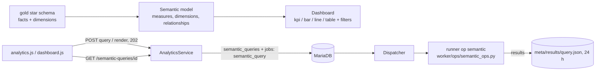

# Warehouse, semantic models and dashboards (M9, release 1.2)

## Warehouse

A star schema in the gold layer has:
- **fact tables** with surrogate-key foreign keys and measures;
- **dimensions** with a surrogate key, the business key and attributes (for SCD type 1: one row per entity, current values).

Students build it with SQL transforms or pipelines. The runner data check `references` verifies referential integrity: every non-null key exists in the dimension.

## Semantic model

A resource of type `semantic_model` (API id = resource public id), stored in `semantic_models`.

| Part | Rules |
|---|---|
| `fact` | One `silver.x` / `gold.x` table |
| `relationships` | Many-to-one from the fact table to a dimension table (`fact_column` = `column`). One hop, each table at most once (a star). |
| `measures` | `{name, agg, column}` with `agg` ∈ sum, count, count_distinct, avg, min, max (`count` may omit the column), or `{name, ratio: [a, b]}` over two aggregated measures (`a / NULLIF(b, 0)`). Optional `label` and `format` (number, integer, currency, percent; display only). |
| `dimensions` | `{name, column, table?, grain?}`. The table defaults to the fact table and must otherwise be related. `grain` (day, week, month, quarter, year) needs a DATE/TIMESTAMP column. |

Validation runs at save time:
- JSON Schema (`semantic_model.schema.json`);
- rules the schema cannot express, checked against the workspace **catalog**: ready silver/gold tables and their columns, taken from metadata with no engine call.

Errors carry JSON-pointer fields (`definition/measures/2/ratio/1`). A model change that would break one of its dashboards is refused with 409 `MODEL_IN_USE`, and so is deleting a model that dashboards still use.

## Dashboard

A resource of type `dashboard` bound to one model of the same workspace.
- **Widgets:** 1–12, of types `kpi` (no dimension), `bar` and `line` (dimension required) and `table`. Each has 1–4 measures and optional `order` and `limit`.
- **Filters:** an optional `date_filter` on a date dimension, and up to 3 value filters.

The viewer sends the selected filter values to `POST /dashboards/{id}/render`. Only the declared filters are accepted, and dates must be ISO `YYYY-MM-DD`.

## Query execution (op `semantic`)

- **One job per exploration or render.** A render runs every widget query, plus one distinct-values query per declared filter. The request snapshot (model + queries) is stored in `semantic_queries.request`.
- **Compilation:** the runner validates the model again, joins only the dimension tables a query needs (`LEFT JOIN`, so facts are never dropped), groups by the requested dimensions and orders by output position. Every filter value is a bound parameter.
- **Sandbox:** read-only connection, no file access (`allowed_directories = []`), locked configuration, a 10 s interrupt per query, 1,000 rows per query and a byte budget for the job.
- **Errors per query:** a failing query (for example, a dropped table) returns `{error}` in its own slot, so the other widgets still render.
- **Results:** reshaped by `SemanticQueryHandler` and kept for 24 h (purged by the scheduler with the SQL Lab results).

## UI

- `/app/workspaces/{id}/analytics` lists the models and dashboards and shows the catalog. It has a JSON editor (CodeMirror) with templates, validation, save and delete. A saved model can be explored with a quick query.
- `/app/dashboards/{id}` is the viewer: a filter bar, KPI cards, and Chart.js 4 bar and line charts (vendored, no CDN; canvas drawing needs no inline styles in markup).
  - Every chart has `role="img"` with a summary label and a "Ver datos" data table.
  - Values are rendered with `.text()`.

## Lab checks (M9)

| Check | Used by |
|---|---|
| `references` (runner) | LAB-007 |
| `semantic_model_has`, `dashboard_has_widgets` (PHP) | LAB-009 |

The PHP checks match measures and dimensions by **what they compute** (`{agg, column}`, ratios by operands, `{table, column, grain}`), not by their names. See `LAB_ENGINE.md`.

## Security gate (M9, 2026-10-07)

Verdict: **PASS WITH FINDINGS**, with 0 Critical or High findings. All findings were fixed before release:

| ID | Severity | Fix |
|---|---|---|
| L1 | Low | The runner accepted ratios of ratios, so a model edited outside the API could produce exponentially large SQL. Ratio operands are now checked against the aggregated measures only (`test_malicious_models_are_rejected[nested-ratio]`). |
| L2 | Low | A filter `dimension` sent as an array caused a 500 (`TypeError`). It is now type-checked and answers 422. |
| L3 | Low | Dashboard creation and updates, and the dashboards-still-valid check of a model update, now re-read the model under the workspace lock that every model and dashboard write takes. Dashboards whose model resource is deleted are not visible. |
| L4 | Low (tests) | New test: markup in widget titles and measure labels is escaped in the HTML and in the JSON data block (`JSON_HEX_TAG`). Another tenant gets the same 422 for a foreign `model_id` as for a nonexistent one. |
| I1 | Info | Semantic queries of deleted models or inactive workspaces are no longer readable. |
