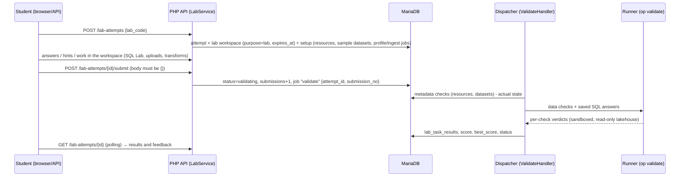

# Lab Engine (M6)

Implements ADR-008: declarative labs (JSON) and a closed set of checks. Grading inspects the **actual state** of a dedicated lab workspace; nothing a client sends is ever trusted as a result.

## Content

Each lab is a directory under `labs/`:

| Path | Purpose |
|---|---|
| `labs/LAB-xxx/lab.json` | Definition, validated by `labs/schema/lab.schema.json` (JSON Schema 2020-12, opis/json-schema) plus semantic rules in `LabDefinition` |
| `labs/LAB-xxx/instructions.es.md` | Introduction, then one `## <task key>` section per task (GitHub-flavoured Markdown, raw HTML escaped) |
| `labs/LAB-xxx/solution/solution.json` | Reference solution as API steps. Used by `tests/Labs/LabSolutionsTest`, never served. |

- **Sample data:** `public/assets/datasets/retail/*.csv` is synthetic, CC0 and deterministic (`php scripts/generate-retail-data.php`). The same files are downloadable and loaded by setup.
- **Import:** `php scripts/labs-import.php [--dry-run] [labs/LAB-xxx …]`.
  - A `code@version` is immutable. Changed content needs a version bump, otherwise the import reports a conflict.
  - The new version becomes current.
  - Attempts keep the version they started with.

### Setup actions (closed set)

| Action | Effect |
|---|---|
| `create_resource` | Storage or lakehouse resource in the lab workspace, active immediately |
| `load_sample` | Copies a platform sample into the workspace's raw storage (raw dataset + `profile` job). With `ingest_to: bronze.<t>` it also creates the bronze table (`ingest` job). |

Datasets created by setup are marked `lab_setup`. They cannot be deleted (409 `LAB_MANAGED`), so a student cannot swap the reference data that expected results are computed from.

### Check types (closed set)

| Type | Evaluated by | Verifies |
|---|---|---|
| `resource_exists` | PHP (metadata) | Active storage or lakehouse, optional name, config subset and tags subset |
| `resource_deleted` | PHP | A resource with that name existed and none is live any more |
| `dataset_exists` | PHP | Raw dataset (by name) or table (by layer and name), active and with a ready version |
| `container_exists` | PHP (M7) | Object-storage container by name (optionally in a named storage resource); optional `lifecycle` subset |
| `object_exists` | PHP (M7) | Exactly one of `key` or `prefix` (+ `min_count`); optional `metadata` subset and `tier` on every match |
| `pipeline_has_nodes` | PHP (M7) | A pipeline (optionally by name) whose current definition contains all `node_types` |
| `pipeline_run_succeeded` | PHP (M7) | The latest run of a pipeline (optionally by name) succeeded, optionally writing `output` (`silver.x` / `gold.x`) |
| `references` | Runner (M9) | Every non-null key of `table.columns` exists in `ref_table.ref_columns` (referential integrity; reports the orphan count) |
| `semantic_model_has` | PHP (M9) | A semantic model (optionally by name) with the expected `fact`, `relationships`, `measures` and `dimensions`, matched by what they compute (`{agg, column}`, ratios by operands, `{table, column, grain}`), not by their names |
| `dashboard_has_widgets` | PHP (M9) | A dashboard (optionally by name) with widgets of the given type bound to the expected measure/dimension (resolved through its model), plus optional `filters` and `date_filter` |
| `table_has_columns`, `column_type`, `row_count`, `null_count`, `unique`, `value_range` | runner | Structure and data of a `bronze\|silver\|gold.<table>` |
| `query_result_matches` | runner | Compares the result of `expected_sql` with `actual_sql` (author SQL over the student's tables) or, for exercise tasks (`"answer": true`), the student's **saved SQL answer** |

`query_result_matches` details:
- Column names are ignored; the column count must match.
- Rows are compared as a multiset unless `ordered` is set.
- Numbers are rounded to `decimals` (default 2) with a half-unit tolerance.
- Dates and midnight timestamps compare equal.
- Results are capped at 1,000 rows (`lab_compare_max_rows`).

## Security model

- **Untrusted inputs:** only the student's saved SQL answers and the state they built.
  - Answers go through the same SQL Lab sandbox: `validate_select`, read-only connection, `allowed_directories = []`, locked configuration, per-statement interrupt, bounded fetch, OS memory cap.
  - Author SQL from `lab.json` is trusted platform content but goes through the same path.
  - Structural checks build SQL only from validated identifiers (`^(bronze|silver|gold)\.[a-z][a-z0-9_]*$`, quoted).
- **Client claims:**
  - `POST /submit` accepts only `{}`; any field returns 422.
  - Hint penalties are read from the definition on the server, never from the client.
  - Runner verdicts cannot override metadata verdicts.
- **Confidentiality:** checks, expected SQL and solutions never leave the server. Responses expose titles, Markdown instructions, hint texts once revealed (penalty recorded once, `lab_hint_usage` primary key) and feedback.
- **Isolation:**
  - Attempts are tenant-owned (composite FKs).
  - Visibility is the owner plus tenant-wide roles (org_admin) and the staff of the attempt's course (M10a), read-only.
  - Mutations are owner-only (403 for visible non-owners, 404 for everyone else).
  - All `{attempt_id}` routes are covered by `TenantIsolationTest`.
- **Resources:**
  - At most 3 attempts in progress per user (`quotas.active_lab_attempts_per_user`).
  - Lab workspaces do not count towards the general workspace quota.
  - Sample bytes count towards the storage quota.
  - Validation timeout is 150 s, each statement is interrupted after 10 s, and the active-jobs quota applies to submissions.

## Lifecycle

| Status | Meaning |
|---|---|
| `in_progress` | Working; can save answers, reveal hints and submit |
| `validating` | A `validate` job is queued or running. Answers, hints, submit and abandon return 409. |
| `completed` | All tasks passed at least once. Resubmission is allowed and `best_score` is kept. |
| `abandoned` | Student gave up; workspace soft-deleted (storage released by the scheduler) |
| `expired` | Lab workspace inactive for `cleanup.workspace_ttl_days`; expiry is extended on every answer and submission |

Scoring:
- A task passes when all of its checks pass.
- A passed task earns its points minus its revealed hint penalties, never below 0. A failed task earns 0.
- `score` is the latest submission; `best_score` is the maximum.

Lab workspaces (`purpose = lab`) cannot be deleted through the workspace API (409 `LAB_WORKSPACE`). Abandoning the attempt releases them.

## M6 security gate (2026-10-06): PASS, findings fixed

| Finding | Fix |
|---|---|
| Medium: start/abandon loops queued unlimited setup jobs (8 per LAB-003 start), and the dispatcher still ran jobs of deleted workspaces | Starting a lab requires the user's active jobs to be below `active_jobs_per_user`. Abandon and expiry cancel the workspace's queued jobs. The dispatcher cancels any claimed job whose workspace is deleted (`WORKSPACE_DELETED`). |
| Medium: hints could be read for free in a throwaway attempt, then the lab restarted | Revealed hints (and their penalties) carry over to new attempts of the same lab in the same tenant |
| Low: failing author SQL (`expected_sql`/`actual_sql`) echoed DuckDB errors that could name hidden tables or columns | Generic messages for author-SQL failures; detailed errors only for the student's own answer |

Accepted residual risks:
- **Completed attempts keep their lab workspace until TTL or abandon.** They do not count towards the 3 in-progress attempts. This is bounded by the number of published labs and by the storage quota.
- **Hint carry-over is per tenant.** The same lab started in another tenant (for example, an organisation) starts with no hints revealed.
- **Lakehouse bytes are not part of the per-user storage quota** (cap of 200 MB per workspace). This is planned with usage counters in M11a.

## Deferred

- Expiry warning email at day 11 (M11a).
- `pipeline_run_succeeded` and `job_succeeded` checks (M7).
- Instructor UI authoring (release 1.2).
