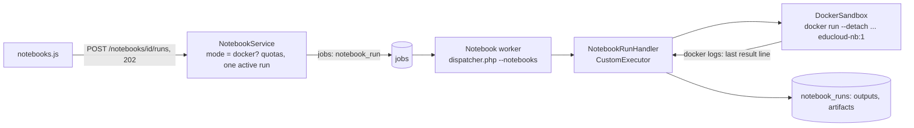

# Notebooks in a Docker sandbox (M8, release 1.3)

Implements ADR-010: student Python runs **only** inside an ephemeral container. This is the only place where the platform executes arbitrary student code, so the isolation suite (`tests/Sandbox/NotebookIsolationTest.php`) is a release gate (master plan risk R3).



## Modes (`NOTEBOOKS_MODE`, `config/execution.php → notebooks.mode`)

| Mode | Behaviour |
|---|---|
| `off` | Notebooks page shows a disabled notice; no creation. |
| `demo` (default) | Notebooks can be created and edited; **Run** answers 409 `NOTEBOOKS_DISABLED`; labs with `"requires": ["notebooks"]` cannot start. |
| `docker` | Runs execute in the sandbox. `check-env` FAILs when the daemon or the image is missing. Enable only after `vendor/bin/phpunit --testsuite Sandbox` passes on the machine. |

## Execution model

- A run executes every **code** cell of a snapshot, in order, in **one fresh container** (no persistent kernel), and stops at the first failing cell.
- Captured per cell:
  - stdout/stderr, each capped at 20,000 characters, with a truncation note;
  - the repr of the last expression;
  - pandas DataFrames and lists of dicts, as tables of at most 50 rows;
  - the error type, message and line.
- Helpers:
  - `lakehouse()` opens a read-only DuckDB connection (external access off, configuration locked) to a **copy** of the workspace lakehouse;
  - in a workspace without a lakehouse, `lakehouse()` raises a clear `FileNotFoundError` asking the student to load data first;
  - `save_result(name, frame)` records up to 5 artifacts of up to 1,000 rows each.
- Time limits, in layers:
  1. **Per-cell alarm** (30 s, SIGALRM raised as a `BaseException`). This is a usability feature only: student code runs in the executor's process and **can disable it** (`signal.alarm(0)` or a custom handler).
  2. **Run timeout** (`timeouts.notebook_run`, 120 s), enforced by the dispatcher, which polls `docker inspect` and runs `docker kill`. Cancellation also uses `docker kill`.
  3. **PID 1 guard.** The image entrypoint is `timeout -s KILL 150 python -I nb_exec.py`. PID 1 is protected by the kernel against signals from the student user, so the container dies at 150 s **even if the dispatcher died mid-run** (gate M8-F1, verified by killing the PHP process during an endless output loop).

## Dispatching

- Notebook runs are claimed only by a **dedicated worker**: `php scripts/dispatcher.php --notebooks`, with its own lock. The main dispatcher excludes `notebook_run` jobs, so a 2-minute notebook never delays SQL Lab queries or lab grading (gate M8-F6). Setting `NOTEBOOKS_DEDICATED_WORKER=0` makes the main dispatcher run them as well.
- **Orphan reaper.** Containers carry the label `educloud.nb=1`.
  - At start, the process that owns notebooks removes **all** labelled containers and run directories, because none can legitimately be running.
  - `Maintenance` (scheduler) removes labelled containers older than 210 s (whatever their state, so it never races the worker reading a finished run), plus run directories older than 10 min.

## Isolation (exact flags, asserted by `tests/Unit/Notebooks/DockerSandboxArgumentsTest.php`)

```
docker run --detach --name educloud-nb-<ulid> --label educloud.nb=1 --network none --read-only
  --tmpfs /tmp:rw,nosuid,nodev,noexec,size=64m --shm-size 16m --memory 512m --memory-swap 512m --cpus 1
  --pids-limit 128 --ulimit nofile=256:256 --ulimit core=0:0 --cap-drop ALL --security-opt no-new-privileges
  --user 10001:10001 --log-driver json-file --log-opt max-size=4m --log-opt max-file=2
  --mount type=bind,source=<run>/in,target=/in,readonly
  --mount type=bind,source=<run>/lakehouse.duckdb,target=/data/lakehouse.duckdb,readonly
  educloud-nb:1
```

- **Process launch.** `proc_open` with an argument array (no shell). The docker CLI gets only the variables it needs. The container gets **no** environment from the host: there is no `-e`, `--env` or `--env-file`.
- **Results.** There is no writable host mount. Output goes to Docker's `json-file` log, which **rotates inside the Docker VM** (2 × 4 MB), so an output flood can never fill the host disk, even when nobody is reading it. After the container stops, the dispatcher copies the bounded log (`docker logs`, at most `max_log_bytes`, 9 MB) into the run directory. It parses it line by line and keeps only the last result line. The run directory, the lakehouse copy and the container are always removed afterwards.
- **Image** (`worker/notebook/Dockerfile`):
  - `python:3.11-slim` pinned **by digest**;
  - duckdb, pandas, pyarrow and numpy pinned **with hashes** (`--require-hashes`); pip/setuptools/wheel are removed after install;
  - a non-root user `10001`;
  - the read-only executor `nb_exec.py`;
  - built with `php scripts/notebook-image.php build`.
- **Trust: results are self-reported.** Student code runs in the executor's process. It can therefore print a forged result line and exit (`os._exit`) before the executor reports, and nothing inside the container can prevent this. A forged result can only describe the student's own run, and the host treats it as untrusted data. `DockerSandbox::parse()` applies these limits:
  - result lines over 1.1 MB, or with more than 60k brackets, are rejected; JSON depth is limited to 16;
  - cell ids must be notebook ids, and artifact names must follow the `save_result` pattern (at most 5);
  - every row must have one value per column, and text is capped.

  Lab grading never relies on what the run claims:
  - `notebook_artifact_matches` recomputes the expected rows with SQL on the server and compares them, rejecting ragged rows;
  - `notebook_run_succeeded` only says "the student's own run reported success". It is used for points, never for authorization.
- **Forked children.** Before printing its result, the executor kills every other process it can signal (`kill(-1, SIGKILL)`; PID 1, the guard, is immune). A forked child cannot print a later line and replace the result. A child that reaches the executor's exit path exits silently.

## Isolation suite (release gate) — result on 2026-10-07: 17/17 PASS

Every attack below runs against the real image, and each one fails inside the container:

| Attack | Expected outcome |
|---|---|
| Network | No interface except loopback; TCP to public IPs, `host.docker.internal` and the Docker bridge gateway is refused; no DNS. |
| Writes to the filesystem | Writing the root FS, `/in`, the lakehouse (by file or through DuckDB read-write) and `/usr` is denied. `/tmp` is a 64 MB noexec tmpfs (a 100 MB write fails); `/dev/shm` is 16 MB. |
| Host files | Only `input.json` and `lakehouse.duckdb` are visible; no host mounts and no Docker socket. |
| Privileges | uid/gid 10001; `setuid(0)` fails; all capability sets are 0; `NoNewPrivs` is 1; core dumps are off; no host secrets in the environment. |
| Fork bomb | Stopped at the pids limit (127 forks, then `BlockingIOError`). |
| Memory bomb | Killed by the OOM killer, or Python raises `MemoryError`. |
| Infinite loop | Killed at the run timeout (TIMEOUT); the container is gone. |
| Output flood | 32 MB of output stays in the rotated log inside the Docker VM, and the result line still arrives. An endless flood ends in TIMEOUT. `print` output is truncated with a note. |
| Forged result lines | Self-reported results are re-normalised: unknown cell ids, bad artifact names and ragged rows are dropped. Forked children cannot replace the result. |
| PID 1 guard | Signals to PID 1 are dropped and `ptrace` attach fails (EPERM); the guard keeps running. |
| Orphans | Labelled containers and run directories left by a dead dispatcher are reaped. |
| Cleanup | No container and no run directory is left behind. |

**Observed while building the gate.** Under heavy forking, the executor received a SIGINT. The likely cause is Docker's signal proxy on the attached `docker run` that the first design used. Runs are now detached, and the executor ignores SIGINT and SIGTERM anyway, because it never needs them.

**Residual risks / assumptions.**
- The isolation relies on the Docker Desktop VM (WSL2) and the kernel. Keep Docker Desktop updated.
- Re-run the suite after any change to the image, the base digest or the flags.
- The web server never talks to the Docker daemon. Only the dispatcher talks to it, running as the local service user.
- A student can forge their **own** run's results (see Trust). Labs therefore grade notebook output against server-side SQL, and nothing else depends on it.
- The per-cell alarm can be disabled by student code. The run timeout and the PID 1 guard are the real time limits.
- The PID 1 guard runs as the student's UID. Signals cannot reach it (init protection), and `ptrace` attach is denied by Yama (`ptrace_scope` = 1 in the Docker Desktop VM). The Sandbox suite asserts both, so a change in the VM kernel settings fails the gate.
- The guard (150 s) and the reaper age (`DockerSandbox::ORPHAN_AGE_S`, 210 s) are fixed in the image and code. Keep `timeouts.notebook_run` below 140 s; `DockerSandboxArgumentsTest` fails otherwise.
