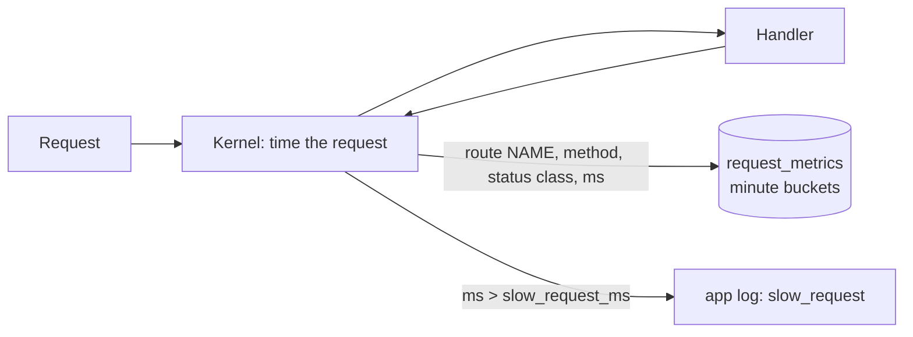

# Observability (M11b)

This page covers what an operator can see in **/app/admin → Observabilidad** and through `/api/v1/admin/{health,metrics,logs}`. Everything here is restricted to platform admins (`php scripts/admin.php grant <email>`). There are no external services and no new dependencies.

| Question | Where to look |
|---|---|
| Is everything running? | Component cards, from `GET /api/v1/admin/health` |
| Is the platform slow or failing, and where? | HTTP KPIs, chart, route tables and job table, from `GET /api/v1/admin/metrics?window=1h\|24h\|7d` |
| What happened in the request a student reported ("ID: 01J…")? | Log lookup, from `GET /api/v1/admin/logs?request_id=…` |

## Request metrics

- The Kernel times every request. It records the request under the route's **name** from the registry (`workspaces.show`), never the URL, so ids never reach the table. Unknown paths are recorded as `_unmatched`. Static assets are served by Apache and are not counted.
- Each row covers one minute × route × method × status class. It stores:
  - the number of requests, the total ms and the maximum ms;
  - a fixed latency histogram: ≤50, 100, 250, 500, 1000, 2500 and 5000 ms, plus above 5000 ms.
- **Percentiles are approximate.** p50, p95 and p99 are the upper bound of the bucket that holds the nth request (nearest rank). For the open bucket the observed maximum is used. The UI says so.
- **Cost:** one indexed upsert per request, **measured** on 2026-10-08 on the development machine at p50 0.9 ms and p95 1.4 ms over 1,000 writes. Disable it with `OBSERVABILITY_REQUEST_METRICS=0`.
- **Failure handling:** a recording failure never breaks a response. It is caught, logged once per process (`request_metrics_failed`), and the response is returned unchanged.
- **Cardinality is bounded:**
  - route names come from the registry, plus the sentinels `_unmatched`, `_unnamed` and `_invalid`;
  - methods are allowlisted (7 plus `OTHER`), and the status class is 1–5;
  - rows are kept for 14 days.

  Unknown paths are not rate limited, so a flood of them costs one upsert per request on a single hot row (`_unmatched`, GET, 4xx). The front web server or proxy should rate limit such floods. If needed, turn recording off with `OBSERVABILITY_REQUEST_METRICS=0` (gate M11b-F2, accepted).
- **Slow requests:** requests above `observability.slow_request_ms` (2,000 ms) log a `slow_request` warning with the route name, method, status and duration only.

## Job metrics

Computed on demand from the `jobs` table for the selected window (newest 5,000 jobs). For each job type the report gives:
- the count, the active jobs, and the failed, timed-out and cancelled jobs;
- the failure rate (failed or timed out over finished);
- the queue wait (`started_at − queued_at`) and run time (`finished_at − started_at`) at p50 and p95, using exact nearest-rank percentiles.

## Component health

Background processes write a heartbeat to `component_heartbeats` at most every 15 s. The details are allowlisted to counts and booleans.

| Component | Source | Status rules |
|---|---|---|
| `database` | `SELECT 1` | `down` on error; latency in ms |
| `queue` | `jobs` | `warning` when the oldest queued job waits more than 60 s |
| `dispatcher` | heartbeat of `scripts/dispatcher.php` | `down` without a heartbeat in 60 s |
| `dispatcher_notebooks` | heartbeat of `scripts/dispatcher.php --notebooks` | `disabled` unless `NOTEBOOKS_MODE=docker`; `down` after 60 s; `warning` when the worker reports that Docker or the image is unavailable |
| `scheduler` | heartbeat written by each `scripts/scheduler.php` run | `down` without a run in 15 min |
| `mailer` | heartbeat of `scripts/mailer.php` + `email_outbox` | `ok` while idle with nothing to send; `down` when mail is waiting and no mailer runs; `warning` when the oldest due email is older than 10 min |
| `storage` | `STORAGE_PATH` | `down` when not writable; `warning` below 1 GB free |
| `runner` | the Python venv and `runner.py` exist | `down` when missing |

The overall status is the worst component status. The web server **never** calls the Docker daemon (ADR-010): the notebook worker checks Docker once a minute and reports a boolean. The public `/api/v1/health` is unchanged, minimal (database only) and suitable for load balancers.

## Log lookup

- Error dialogs show the request id (`X-Request-Id`). Pasting it into the lookup lists that request's events.
- Without an id, the lookup shows the warnings and errors of the last two days.
- Only `ts`, `level`, `event` and `request_id` are returned. The log `context` never leaves the server, even redacted, because it can hold student data.
- **Bounds:** the last 2 days of logs, lines up to 64 KB, at most 20 MB read per call (the tail of each file), and 200 entries.

## Retention

The scheduler applies retention through `Maintenance`:
- `request_metrics` rows older than 14 days are purged;
- `app-YYYY-MM-DD.log` files older than `LOG_RETENTION_DAYS` (30 by default) are deleted. No other file in the log directory is touched.

## Privacy and security

- Metrics hold no tenant, user, id, path, SQL or payload data: only route names, methods, status classes and timings.
- All three endpoints require the `platform_admin` permission, which no tenant role holds. Others get 403.
- Inputs are validated: the window comes from an allowlist, the request id must be ULID-shaped, and the level must be `info`, `warning` or `error`.

## Not included (candidates for M12)

- A Prometheus `/metrics` endpoint behind a token, OpenTelemetry tracing.
- External alerting (email, chat) when a component goes down.
