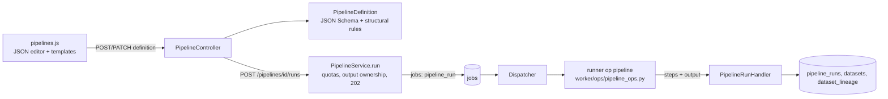

# Pipelines, lineage and object storage (M7, release 1.1)

Implements ADR-009 (a minimal in-house pipeline engine instead of Airflow, Dagster or Prefect) on top of the execution
plane (`EXECUTION.md`), plus dataset lineage and an object-storage service for LAB-002.

## Pipelines

**Definition.** A pipeline is a resource of type `pipeline` (its API id is the resource public id) with a row in
`pipelines` holding the JSON definition and a version counter. The definition is a **linear chain** of nodes:

| Node | Compiles to |
|---|---|
| `source` | `SELECT * FROM <layer>.<table>`, or a reader over a raw file (`raw: <dataset name>`) resolved by the dispatcher |
| `filter` | `WHERE` with allowlisted operators; every value is a bound parameter |
| `select` | Column list with optional `as`, an allowlisted `transform` (lower, upper, trim, abs, round, year, month, date, month_start) and `cast` |
| `join` | `inner`/`left` join with one lakehouse table on column pairs, keeping the listed right-hand columns |
| `aggregate` | `GROUP BY` with sum, count, avg, min, max, count_distinct |
| `sql` | One student `SELECT` over the previous step (`input`), checked by the SQL Lab sandbox (`validate_select` + parse-tree check) |
| `quality_check` | not_null, unique, row_count, range, accepted_values; `on_fail: stop` (default) or `warn` |
| `output` | `CREATE OR REPLACE TABLE silver\|gold.<table>`, then the lakehouse size cap |

**Validation happens twice.**
- PHP (`PipelineDefinition`): JSON Schema (`pipeline.schema.json`, opis) and then structural rules: the first node is
  `source`, the last is `output`, ids are unique, and values are present where an operator needs them. Errors carry
  precise field paths such as `definition/nodes/1/conditions/0/op`.
- Runner: the same rules are enforced again, because the runner never trusts its input.

**Execution.** Each step is materialised as a TEMP table `_step_i`, with row (`max_rows`) and column (`max_columns`)
caps checked after every step. Only the final table is persisted. The connection is configured with the usual
sandbox:
- no external access;
- locked configuration;
- `allowed_directories` limited to the workspace directory, and only for raw inputs.

**Runs.**
- `PipelineService::run` checks, in order:
  - a lakehouse exists and still has room;
  - usage and active-jobs quotas;
  - no other active run of the same pipeline (409);
  - raw inputs are ready (422);
  - **output ownership**: the output table must not exist, or must have been created by this pipeline
    (`resource_config.pipeline_id`), otherwise 409.

  The run stores a **snapshot** of the definition (later edits do not change past runs).
- On success, the output version becomes `ready`, a new output dataset becomes `active`, lineage edges are recorded,
  and the per-step report (rows, `duration_ms`, quality messages) is saved.
- On failure, the report up to the failing step is saved as a partial result:
  - a dataset created by the run is removed and its name released;
  - for an existing dataset, the new version is deleted.
- Cancellation and transient retries use the generic job mechanisms (`EXECUTION.md`).

## Lineage

`dataset_lineage` stores edges `(target, source, via)` with `via` ∈ `ingest`, `transform` and `pipeline`. Edges are
derived server-side only, never from client input:

| Via | Recorded from |
|---|---|
| `ingest` | Raw dataset → its bronze table |
| `transform` | Table references reported by the runner (`read_tables`, from the parse tree) |
| `pipeline` | The pipeline's source/join tables and raw inputs |

`LineageRepository::record` resolves names inside the same tenant and workspace with `INSERT IGNORE … SELECT`, so an
edge can never point across workspaces. `GET /datasets/{id}/lineage` returns direct upstream and downstream
neighbours. The datasets table shows them in a modal.

## Object storage

A storage resource holds **containers** (`storage_containers`; name `^[a-z0-9][a-z0-9-]{2,62}$`, unique per storage).
A container holds **objects** (`storage_objects`).

| Concept | Implementation |
|---|---|
| Key | Display name made of `/`-separated segments of `[A-Za-z0-9._ -]`, each starting with a letter or digit (no `..`, no absolute paths, no backslashes). Unique per container; uploading the same key replaces the object and deletes the old bytes. |
| Bytes | Stored under `objects/{ULID}.bin` in the workspace directory; SHA-256 recorded; `Content-Type` assigned by the server from the validated format. |
| Metadata | String key/value pairs, same rules and limit as resource tags. |
| Tier | `hot`, `cool`, `archive`. Archived objects cannot be downloaded (409 `OBJECT_ARCHIVED`) until moved back to hot or cool ("rehydration"). |
| Lifecycle | Optional `{archive_after_days, delete_after_days}` per container, with archive < delete. `Maintenance::run` (scheduler, every 5 min) archives and deletes objects by age since upload; it is idempotent. |
| Download | Always `application/octet-stream` with `Content-Disposition: attachment` (ASCII fallback + RFC 5987 name). Content is never rendered inline. |
| Quotas | `containers_per_storage` (20), `objects_per_container` (200), with object bytes counted in the user's storage quota (`UsageRepository::rawBytes`). Counts are re-checked under the per-user lock. |
| Guards | A non-empty container cannot be deleted (409 `CONTAINER_NOT_EMPTY`), nor can a storage resource that still has containers (409 `STORAGE_NOT_EMPTY`). |

Objects are never read by the runner. Pipelines and SQL read only lakehouse tables and raw dataset files.

## Lab checks (M7)

`container_exists`, `object_exists`, `pipeline_has_nodes` and `pipeline_run_succeeded` are metadata checks evaluated
in PHP from the real state (`LabStateRepository`). See `LAB_ENGINE.md`. They power LAB-002 and LAB-006.

## Security gate (M7, 2026-10-07)

Verdict: **PASS WITH FINDINGS**, with 0 Critical or High findings. Fixed before release:

| ID | Severity | Fix |
|---|---|---|
| M7-01 | Medium | Student SQL in a pipeline `sql` node could write `.json`/`.txt` files inside its own workspace with `enable_profiling(save_location := …)` when the pipeline also read a raw file. Two fixes: table functions are now allowlisted (`range`, `generate_series`, `unnest`, `json_each`, `json_tree`), and `enable_*`/`disable_*`/`*checkpoint` are denied by name. Pipelines no longer get directory access: only the exact raw input files are readable (`allowed_paths`). Tests: `test_sql_node_cannot_touch_files_even_with_raw_inputs`. |
| M7-02 | Medium | A container deleted while an upload was in flight could orphan object bytes outside the quota. Uploads and deletion now serialise on a container row lock, the object count is re-checked under that lock, and the foreign key is `ON DELETE RESTRICT` (migration 0015). |
| M7-03 | Low | Container creation now takes the storage row lock and requires `active`. The storage-not-empty guard runs under the same lock. |
| M7-04 | Low | Downloads send `Cache-Control: no-store, private` and are streamed (`Response::file`, `readfile`) instead of being loaded into memory. |
| M7-05 | Low | `tests/Security/M7RoleAccessTest.php` covers another student (404), read_only (403 on every write) and org_admin access. |
| M7-07 | Info | Status classes in `pipelines.js` are set with `.addClass()`, not built inside HTML strings. |

Accepted (tracked for a later release):

| ID | Item | Plan |
|---|---|---|
| M7-06 | Rehydrating an archived object does not reset the lifecycle clock (based on `created_at`), so the next scheduler pass archives it again. | Add `tier_changed_at` and base the archive rule on it. |
| M7-08 | A run cancelled or killed after the output `CREATE OR REPLACE` leaves the replaced table while its version row is removed. This only affects the student's own data. | Write to a temp table and rename it as the last action. |
| M7-09 | `PipelineService::delete` checks the last run status outside the workspace lock. A racing run completes against a soft-deleted pipeline, which is harmless. | Move the check under `lockActiveWorkspace`. |
