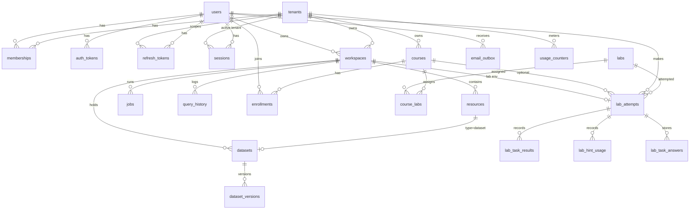

# EduCloud Lab — Database Schema

- **Schema:** `educloud` (test copy: `educloud_test`). InnoDB, utf8mb4_unicode_ci, timestamps in UTC as `DATETIME(3)`.
- **Source of truth:** `database/migrations/*.sql`, applied with `php scripts/migrate.php up [--test]`.
- **Compatibility:** MariaDB 10.4 (dev) and MySQL 8.0 (target), per ADR-002.

## Database users

| User | Privileges | Used by |
|---|---|---|
| `educloud_migrator` | ALL on `educloud.*`, `educloud_test.*` only | `scripts/migrate.php` |
| `educloud_app` | SELECT, INSERT, UPDATE, DELETE on `educloud.*` | the web app, dispatcher and mailer at runtime |
| `educloud_test` | ALL on `educloud_test.*` | PHPUnit |

Credentials live only in `.env`. The MariaDB `root` account is never used by the application.

## Tenant isolation at the database level

- Every tenant-owned parent has `UNIQUE (tenant_id, id)`.
- Children reference parents with composite FKs `(tenant_id, parent_id)`, so a row in tenant B can never point at a workspace, resource, dataset, course or attempt of tenant A. This is verified: an insert attempting it fails with error 1452.
- Composite FKs cannot use `ON DELETE SET NULL`, because `tenant_id` is NOT NULL. Nullable composite links use `RESTRICT`, and service code clears them before hard deletes.

## Tables

| Table | Purpose | Owner / scope | Milestone |
|---|---|---|---|
| `schema_migrations` | Applied migrations + checksum | system | M1 |
| `tenants` | Personal or organization tenant | platform | M2 |
| `users` | Accounts: email, password hash, status, lockout, platform-admin flag | global | M2 |
| `memberships` | User ↔ tenant with role (`org_admin`, `instructor`, `student`, `read_only`) | tenant | M2 |
| `auth_tokens` | Email-verify and password-reset tokens (SHA-256 hash only, single use) | user | M2 |
| `refresh_tokens` | JWT refresh tokens: hash, rotation family, revocation | user | M2 |
| `rate_limits` | Fixed-window counters keyed by HMAC (no raw IP or email) | system | M2 |
| `sessions` | Browser sessions: SHA-256 of the cookie id, user, active tenant, idle and absolute expiry (migration 0009) | user | M2 |
| `workspaces` | Workspace container (general or lab), lifecycle, expiry | tenant | M3 |
| `resources` | Resource registry: storage, lakehouse, dataset, pipeline, notebook, dashboard; status, region, config/tags JSON | tenant | M3 |
| `datasets` | Dataset (1:1 with a `dataset` resource): medallion layer and table name (CHECK `^[a-z][a-z0-9_]{0,62}$`) | tenant | M4 |
| `dataset_versions` | Each upload or materialisation: storage key, size, SHA-256, rows, schema JSON, status. The current version is the highest ready `version_no`. | tenant | M4 |
| `jobs` | Execution queue for the dispatcher: type, status, payload, limits, safe result | tenant | M4 |
| `query_history` | SQL Lab history per user/workspace (`job_id` is a soft link) | tenant | M5 |
| `labs` | Global lab catalog (code `LAB-NNN`, version, JSON definition, checksum) | platform | M6 |
| `courses` | Course in an org tenant: public slug, visibility, hashed join code | tenant | M10a |
| `enrollments` | Course membership as student or instructor | tenant | M10a |
| `course_labs` | Labs assigned to a course (order, required, due date) | tenant | M10a |
| `lab_attempts` | A student's attempt: workspace, status, score, best score, counters | tenant | M6 |
| `lab_task_results` | Per-task result for each submission (passed, points, feedback, evidence) | tenant | M6 |
| `lab_hint_usage` | Hints revealed. The PK guarantees each penalty is applied once. | tenant | M6 |
| `lab_task_answers` | Saved SQL answer per exercise task, re-executed in the sandbox at validation (0011) | tenant | M6 |
| `email_outbox` | Queued emails. The payload is cleared after sending. | system | M2 |
| `audit_logs` | Append-only audit trail. No FKs, so it survives deletion of its subjects. IPs stored as HMAC. | tenant | M3 |
| `usage_counters` | Quota metering per tenant/user/metric/period | tenant | M11a |

**Deferred:**

| Release | Tables |
|---|---|
| 1.1 | `pipelines`, `pipeline_runs`, `dataset_lineage` |
| 1.2 | `semantic_models`, `dashboards`, `modules`, `lessons` |
| 1.3 | `notebooks`, `notebook_runs` |

Custom `roles` and `permissions` tables are deferred per ADR-007.

## ERD

## Backup and restore

- **Backup:** `C:\xampp\mysql\bin\mysqldump -u educloud_migrator -p --single-transaction --routines educloud > educloud_YYYYMMDD.sql`
- **Restore:** `C:\xampp\mysql\bin\mysql -u educloud_migrator -p educloud < educloud_YYYYMMDD.sql`
- Back up before every migration on non-test databases. DDL auto-commits, so a failed migration is not rolled back automatically.
